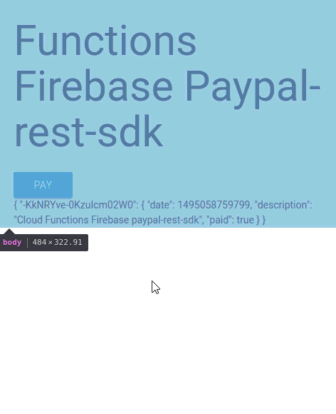

# Accept paypal payment in functions firebase

Example use of Paypal-rest-sdk into functions firebase.
Can be improved.
# Demo


## Functions Code

See file [functions/index.js](functions/index.js) for the code.

The dependencies are listed in [functions/package.json](functions/package.json).

## Process PayPal payments

1. [Set up a payment information object](https://developer.paypal.com/docs/api/quickstart/payments/#set-up-the-payment-information-object) that contains details about the PayPal payment.

2. [Initialize the payment and redirect the user](https://developer.paypal.com/docs/api/quickstart/payments/#initialize-the-payment-and-redirect-the-user). To do so, send the payment object to PayPal. This action provides a redirect URL to which to redirect the user. After the user confirms the payment, PayPal redirects the user to the return URLs specified in the payment object.

3. [Complete the payment](https://developer.paypal.com/docs/api/quickstart/payments/#complete-the-payment). Use the payer and payment IDs provided in the query string following the redirect.


## Deploy and test

 - Enable billing on your project by switching to the Blaze or Flame plan. See [pricing](https://firebase.google.com/pricing/) for more details. This is required to be able to do requests to non-Google services.
  
 - Or use local-emulator : [firebase functions local-emulator](https://firebase.google.com/docs/functions/local-emulator)
  
```sh
firebase serve --only functions  # to only emulate functions
``` 

```sh
firebase serve --only functions,hosting # to emulate both functions and hosting
```

  Create a REST API apps & Sandbox account
 - [Add your Paypal API Secret Key](https://developer.paypal.com/developer/applications/)
  

run:
```sh
firebase functions:config:set paypal.client_id="yourPaypalClientID"
```

```sh
firebase functions:config:set paypal.client_id="yourPaypalClientSecret"
```

  In
[functions/index.js](functions/index.js) 

- POST {price:5} to `https://us-central1-<project-id>.cloudfunctions.net/pay` 

redirect to `approval_url`, or
return `response.body.approval_url` go on the `approval_url` to achieve the paiement.

See [Docs API Paypal rest-sdks](https://developer.paypal.com/docs/api/rest-sdks/)
