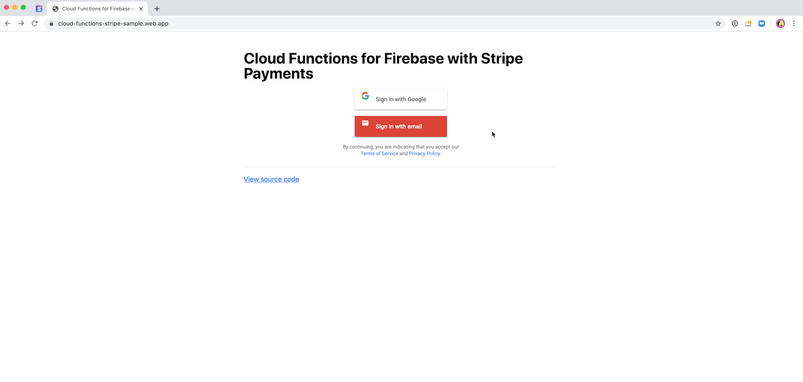

# Create Stripe customers and charge them on Cloud Firestore write

This sample shows you how to create Stripe customers when your users sign up, securely collect and store their payment details, and charge them when a new document is written to your Firestore.

### Features

- Create a customer object in Stripe when a new user signs up. ([view code](./functions/index.js#L29)).
- Securely collect a customers card details with Stripe Elements and set them up for future usage. ([view code](./public/javascript/app.js#L69)).
- Create a payment on the customer's card when a new document is written to the `payments` collection. ([view code](./functions/index.js#L75)).
  - **NOTE:** Note that this example creates the payment document on the client with an amount and currency inputted by the user. In a real application, you need to validate price details in your function, e.g. based on product information stored in your Firestore.
- Handle 3D Secure authentication if required by the card issuer. Read more about 3D Secure and SCA [here](https://stripe.com/payments/strong-customer-authentication). ([view code](./functions/index.js#L114))

#### Further reading:

- Stripe docs: https://stripe.com/docs/payments/save-and-reuse
- 3D Secure and SCA regulation: https://stripe.com/payments/strong-customer-authentication
- Firebase docs: https://firebase.google.com/docs/functions

## Demo

- https://cloud-functions-stripe-sample.web.app/



## Deploy and test

- Create a Firebase Project using the [Firebase Developer Console](https://console.firebase.google.com)
- Enable billing on your project by switching to the Blaze plan. See [pricing](https://firebase.google.com/pricing/) for more details. This is required to be able to do requests to non-Google services.
- Enable Google & Email sign-in in your [authentication provider settings](https://console.firebase.google.com/project/_/authentication/providers).
- Install [Firebase CLI Tools](https://github.com/firebase/firebase-tools) if you have not already and log in with `firebase login`.
- Configure this sample to use your project using `firebase use --add` and select your project.
- Install dependencies locally by running: `cd functions; npm install; cd -`
- [Add your Stripe API Secret Key](https://dashboard.stripe.com/account/apikeys) to firebase config:
  ```bash
  firebase functions:config:set stripe.secret=<YOUR STRIPE SECRET KEY>
  ```
- Set your [Stripe publishable key](https://dashboard.stripe.com/account/apikeys) for the `STRIPE_PUBLISHABLE_KEY` const in [`/public/javascript/app.js`](./public/javascript/app.js#L16)
- Deploy your project using `firebase deploy`
- Test your Stripe integration by viewing your deployed site `firebase open hosting:site`

### Run the client locally

Since this project uses Firebase Auth triggers, the functions need to be deployed. However, when making changes to your client application in the `/public` folder, you can serve it locally to quickly preview changes.

```
firebase deploy --only functions ## only needs to be run when you make changes to your functions

firebase serve --only hosting
```

## Accepting live payments

Once you’re ready to go live, you will need to exchange your test keys for your live keys. See the [Stripe docs](https://stripe.com/docs/keys) for further details.

- Update your Stripe secret config:
  ```bash
  firebase functions:config:set stripe.secret=<YOUR STRIPE LIVE SECRET KEY>
  ```
- Set your [live publishable key](https://dashboard.stripe.com/account/apikeys) for the `STRIPE_PUBLISHABLE_KEY` const in [`/public/javascript/app.js`](./public/javascript/app.js#L16).
- Redeploy both functions and hosting for the changes to take effect `firebase deploy`.
