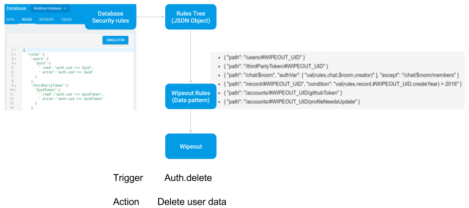
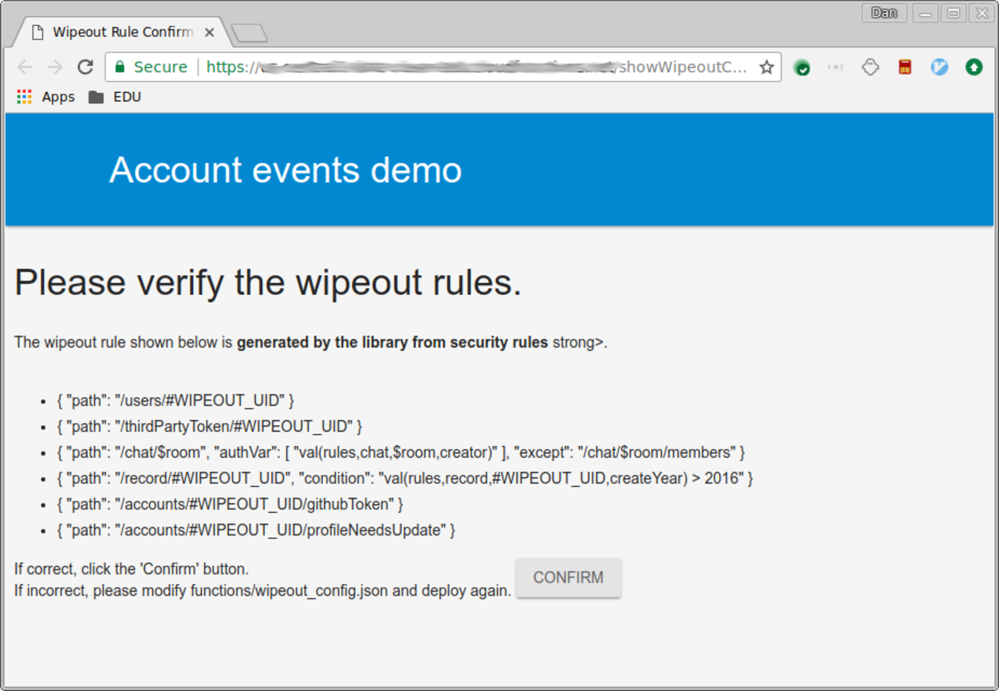

# Auto Wipeout Design
[Dan Zhang][1], July 2017

## Introduction

The auto-wipeout project aims to help Firebase developers protect
privacy of their end-users. Auto-wipeout is a Cloud Functions library
which can automatically find and delete user data on end-user account
deletion. In this way, Firebase customers (Firebase developers) can
focus on making their apps special with a lower cost of writing safer
apps.

Developers can choose to specify user data storing patterns through
local configurations or rely on our Auto Extraction algorithms. If no
local configuration is found, the library takes advantages of the fact
that Firebase security rules imply access pattern in the schemaless
real time database. It fetches security rules and runs the Auto
Extraction algorithms to get Wipeout rules which describe user storing
patterns. After activation, the Cloud Functions will be triggered by
account deletion, wipeout user data according to wipeout rules and log
its behavior. The overall workflow and wipeout rules specs are
described in detail later in this document.

The Difficult part of the project is the Auto Extraction algorithms.
It works by searching the rules tree for write rule, extract access
patterns from single rules and combining access pattern with possible
higher level rules. It needs to deal with complex security rules with
nested logic expressions and data dependent references. The access
extraction of a single rule works by building an auth expression
object in a bottom-up manners and express the final expression in
Disjunctive Normal Form (DNF). More details available in
[Auto Rules Extraction][2].

The library is open-sourced as a [Cloud Functions example on
GitHub][3] with documentation and an example app.

## Overall design
                                   
One important issue in protecting privacy of end-users of Firebase
apps is to identify user data storing location. The knowledge about
where data is stored is crucial to effectively managing and protecting
user data in a the schemaless back-end storing system (Fiorebase
Realtime Database, Cloud Storage).

One way to get these knowledge is to ask the developers to specify
them. This is a good way to get accurate information so we allow
developers to write local configurations describing user data storing
patterns. The problem is this approach adds additional burden to the
developers and may scare them away from using the feature.

The better alternative is to provide a service which automatically
extracts user data storing pattern and asks the developer to verify.
So we built Auto Wipeout with Auto Extraction which generates data
storing pattern (Wipeout Rules) from Security Rules for RTDB.

This Diagram shows the workflow of the current Auto Wipeout library
works. But it can be generalized to a system which supports Cloud
Storage and other variation of Wipeout. The generalized system is
described as the 3-step process:

1.  Parse RTDB or Storage security rules to internal representations
    (json object: Rule tree)
    1.  RTDB parse json object 
    2.  Cloud Storage for Firebase rules: lightweight parser generated
        from PEG.js parse generator. (This part hasn’t yet been open
        sourced.)
2.  Extract user data rules from Rule trees. User data rules are
    patterns describing places where user data are stored. (The
    current library only supports extraction from RTDB rules).
3.  The patterns could be used in different ways:
    1.  Wipeout: auto user data wipeout on user deletion 
    2.  Takeout: user data takeout on user deletion or request
    3.  Monitor: Documentation for developers/ self checking of data
        storage patterns

## Auto Extraction 

The Auto Extraction algorithm generates Wipeout Rules from RTDB
security rules, then save it under the wipeout directory in the
database. The developer will need to go a URL to confirm the rule,
then the `confirm` field will be set to true under the wipeout
directory. This means the auto wipeout functionality is activated.

The detailed algorithm is described in [Auto Rules Extraction][2]. The
web confirmation UI is shown in the figure below:

## Wipeout rules spec

The wipeout rules is a list of JSON object, each of them describes a
pattern of user data storage. When a user account is deleted, the
library goes through every config to remove any match with these
patterns. A single config rule can have four fields:

*   `path`: Mandatory field. A String indicating a location of user
    data. A path can include place holder variables `#WIPEOUT_UID`
    which will be replaced by auth.uid at execution time. It can also
    include free variables which start with `$`. A simple example path
    is `/users/#WIPEOUT_UID`, and an example path field for a chat app
    is `/chat/$room`.
*   `authVar`: Optional field, List of data references. Besides the
    locations marked by `#WIPEOUT_UID` in path, `authVar` is a list of
    values/data references which should equals to the authentication
    uid. For example, the previous chat app example could have
    `authVar: ['val(rules,chat,$room,creator)']` (see data reference
    below for format details). This will restrict the free variable
    $room to the set of chat rooms created by the user who just
    deleted the account because it requires data at
    `/chat/$room/creator` to be `auth.uid`.
*   `condition`: Optional field, string. Any additional restriction on
    the path which is not related to authentication. Logic && and ||
    supported, free variable not supported. An example condition:
    `#WIPEOUT_UID !== someID && val(rules,user,#WIPEOUT_UID,creatYear)
    > 2016`.
*   `except`: Optional field. Subpath which doesn't belong to a single
    user, shouldn't be removed at account deletion. For example,
    shared data under a user data folder. Currently only subpaths
    which are one level deeper than its parent path is supported. An
    example except for /chat/$room/ is /chat/$room/members.

Data reference: A string representing the value or existence of data
at a location in the database. The string format is a call of `val()`
or `exists()`, and the list of arguments stands for the path to the
location. The root of the path is always 'rules'. e.g.
`val(rules,chat,$room,creator)` stands for the value at location
`/chat/$room/creator`.

## Auth.delete triggered data deletion

At execution time, the library will be triggered by a auth.delete
event. With a uid of the account deleted, the Cloud Functions reads
the configs (Wipeout Rules) from the database and materialize it.

Now we describe the materialization: a config will go through the
following process to get a set of materialized absolute paths in the
database:

1.  Swap #WIPEOUT_UID place holder with auth.uid of deleted account.
2.  Evaluate condition, filter out any config with a false condition.
3.  Evaluate `authVar`, retrieve values for variables in path.
4.  Evaluate exception,
5.  Remove any remaining trailing free variables since they represent
    wildcard values in paths. After the removal, any path which still
    have free variable is not supported for deletion and will be
    ignored.

After these steps, we'll have a list of concrete deletion path. The
library goes ahead and deletes the data and record the the paths
together with a timestamp at /wipeout/history/#WIPEOUT_UID in the real
time database.

## Deletion Efficiency

Wipeout rules allow free variables in paths, and these free variables
may imply a search/scan in the database which leads to scalability
issues. For example, consider the following two paths 1)
`/key/#WIPEOUT_UID/$k2` 2) `/key/$k1/#WIPEOUT_UID`. With a specific
UID, 1) describes any valid children of `/key/UID`, while 2) describes
children named UID under any valid children of /key/. In order to get
all data references described by 2), without further information, we
need to go to the database and check any children of `/key/`. This
might become infeasible when the database is large.

## Future works (potential issue list)

1.  Some deletion requires querying the database and can be
    inefficient when the database gets larger and fatter (large
    fan-outs). We could add an option to not do these inefficient
    operations.
2.  The current web confirmation is accessible to anyone with the url.
    We may want to add security check to that.
3.  All wipeout metadata is stored under the wipeout directory in the
    database. We should check for collision of path name to make sure
    the library doesn’t overwrite app data.
4.  Expand Auto Wipeout to Cloud Storage.
5.  Add Pre-hooks and post-hooks which allow developers to run
    customized code before or after deletion.
6.  Support <roll back of deletion. Soft deletion for a fixed amount of
    time.
7.  Developer Confirmation Web UI could explain generated Wipeout Rule
    with an example or a fake user.
8.  Integration tests for the library.

[1]: https://github.com/horseno
[2]: auto_rules_extraction.md
[3]: https://github.com/firebase/functions-samples/tree/master/user-data-cleanup

